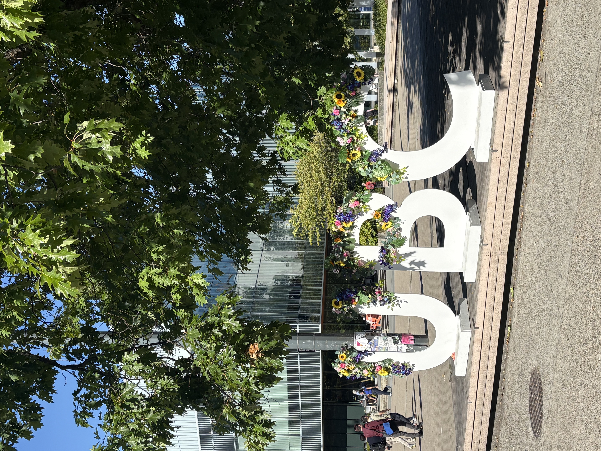

My first few week in the MDS program have been both exciting and intense. Everything moves so quickly that sometimes it feels like I’ve accomplished a month’s worth of work in just one week! After being away from school for several years, coming back to the classroom has brought back a sense of excitement and energy for learning. Every day feels full, with new things to learn, new challenges to work through, and new experiences to enjoy.

I was getting familiar with all the different software, tools, and course schedules, while trying to keep up with the fast pace of the program. One of the best parts so far has been meeting so many new friends. Having people around who are going through the same experience makes the busy days feel more enjoyable.

Although the first few week have been challenging, it has also been very fulfilling. I am gradually finding my rhythm, getting better at managing my time, and becoming more comfortable with the new tools and concepts. 

